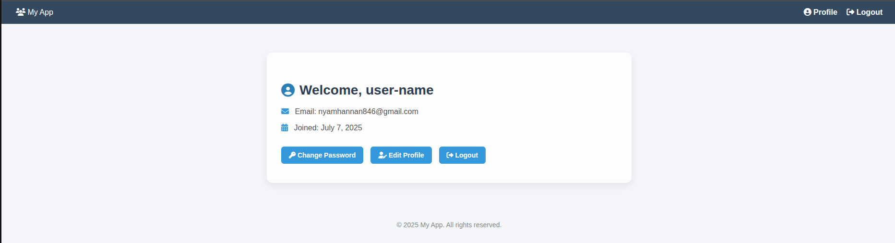
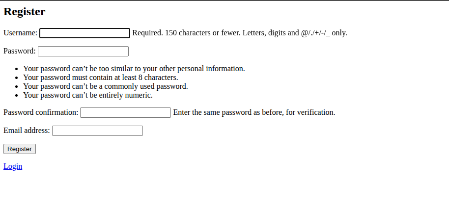
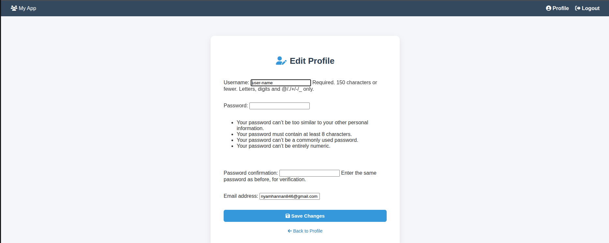

# Django-User-Management
 Below is a **comprehensive README.md template** tailored for your Django User Management project, covering all the requirements, features, testing, git workflow, and optional extras. You can customize it by adding your screenshots, links, and specific details.

# Django User Management Project

## Project Overview

This is a simple Django-based User Management system that provides:

- User registration with email verification (mock)
- Support for user types (optional)
- User profile management (view, edit, change password)
- Admin panel to view and edit all users
- Access control: normal users can only manage their own profile

## Features

- **User Registration:** Users can sign up with username and email. Accounts are inactive until verified.
- **User Verification:** Mock email verification simulated by printing a verification link in the console.
- **Profile Management:** Users can view and edit their profile and change their password.
- **Admin Panel:** Admin users can view and edit all users and profiles.
- **Access Control:** Normal users restricted to their own profiles.

## Installation

### Prerequisites

- Python 3.12+
- Git
- (Optional) Docker

### Steps

1. **Clone the repository**

```bash
git clone https://github.com/yourusername/django-user-management.git
cd django-user-management
```

2. **Create and activate a virtual environment**

```bash
python3 -m venv venv
source venv/bin/activate
```


3. **Apply migrations**

```bash
python manage.py migrate
```

4. **Create a superuser**

```bash
python manage.py createsuperuser
```

5. **Run the development server**

```bash
python manage.py runserver
```

## How to Use

- **Register:** Visit `http://127.0.0.1:8000/accounts/register/` to create an account.
- **Verify:** After registration, check the console for a verification link and visit it to activate your account.
- **Login:** Visit `http://127.0.0.1:8000/accounts/login/`.
- **Profile:** View your profile at `http://127.0.0.1:8000/accounts/profile/`.
- **Edit Profile:** Edit your profile at `http://127.0.0.1:8000/accounts/profile/edit/`.
- **Change Password:** Change your password at `http://127.0.0.1:8000/accounts/password_change/`.
- **Admin Panel:** Admin users can access the admin panel at `http://127.0.0.1:8000/admin/`.

## Git Workflow

This project uses a clean Git commit history with **maximum 10 commits**. Each commit includes:

- A clear, descriptive title.
- A detailed message explaining the changes.

### Example commits

- **Initial commit:** Setup Django project and accounts app.
- **Add user registration:** Implement registration form and view with email verification mock.
- **Add login/logout:** Configure authentication views and templates.
- **Add profile management:** Views and forms for profile view/edit and password change.
- **Configure admin panel:** Register models for admin.
- **Add tests:** Unit tests for models and views.
- **Update README:** Add setup instructions and project overview.

## Testing

Run unit tests using:

```bash
python manage.py test
```

Tests cover:

- Models (e.g., User creation)
- Views (e.g., registration, login, profile)

## Screenshots

_Add screenshots here showing:_
## home page


## registration


## password


## profile



- Registration page
- Verification message
- Login page
- Profile page
- Edit profile page
- Admin panel user list


## Additional Resources

- [Django Documentation](https://docs.djangoproject.com/)
- [GitHub Repository](https://github.com/yourusername/django-user-management)

## Contact and Updates

- Share progress and ask questions in the WhatsApp group.
- Regular updates will be posted during the project development.


